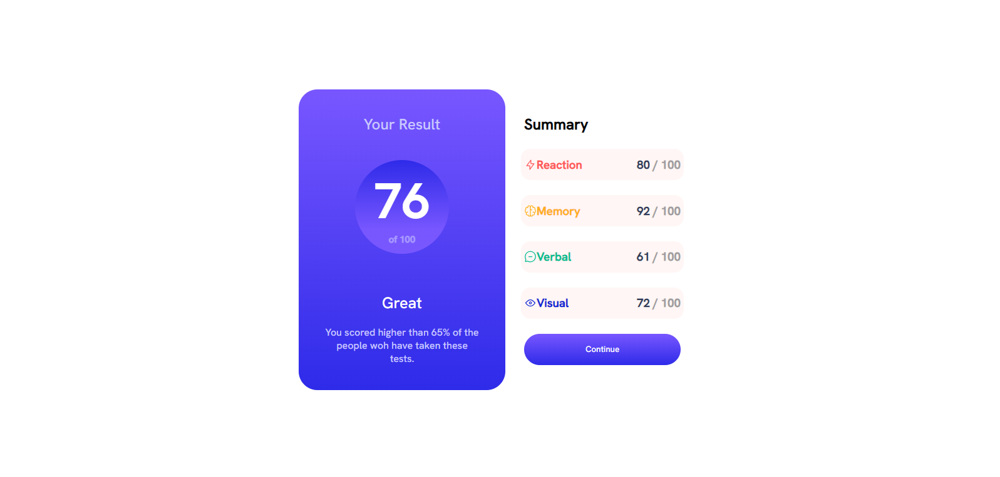

# Frontend Mentor - Results summary component solution

This is a solution to the [Results summary component challenge on Frontend Mentor](https://www.frontendmentor.io/challenges/results-summary-component-CE_K6s0maV). Frontend Mentor challenges help you improve your coding skills by building realistic projects. 

## Table of contents

- [Overview](#overview)
  - [The challenge](#the-challenge)
  - [Screenshot](#screenshot)
  - [Links](#links)
- [My process](#my-process)
  - [Built with](#built-with)
  - [What I learned](#what-i-learned)
  - [Continued development](#continued-development)
  - [Useful resources](#useful-resources)
- [Author](#author)
- [Acknowledgments](#acknowledgments)


## Overview

### The challenge

Users should be able to:

- View the optimal layout for the interface depending on their device's screen size
- See hover and focus states for all interactive elements on the page

### Screenshot




### Links

- Solution URL: [https://github.com/MohamedBenArbi/Results-summary-component]
- Live Site URL: [https://mohamedbenarbi.github.io/Results-summary-component/]

## My process

### Built with

- Semantic HTML5 markup
- CSS custom properties
- Flexbox
- Css media query


### What I learned

-How to use media query to render different styles based on screen size 
-How to import custom fonts from local file 
-How to use gradiant in the background

```css
@font-face {
    font-family: "HankenGrotestMedium";
    src: url(./assets/fonts/static/HankenGrotesk-Medium.ttf);
    }

    @media only screen and (max-width: 600px) {
    .component{
      flex-direction: column;
      justify-content: end;
      width: 100%;
      height: 100vh;
     
      
    }
    .result{
        width: 79%;
        height: 40%;
        border-top-right-radius: 0;
        border-top-left-radius: 0;
        
    }
    .summary{
        width: 79%;
        height: 45%;
        margin-bottom: 20px;
        
    }
  }

  background-image: linear-gradient(hsl(252, 100%, 67%),hsl(241, 81%, 54%));
```


### Continued development

In the futur i would like to make this component more reponsive as well as using better methods to place element with css


### Useful resources

- [WDS](https://www.youtube.com/@WebDevSimplified) - This youtube channel helped me a lot with learning css as well as some method applied to this mini project 


## Author

- Website - [MohamedBenArbi](https://www.your-site.com)
- Frontend Mentor - [@yourusername](https://www.frontendmentor.io/profile/MohamedBenArbi)
- Twitter - [@Arbiii01](https://twitter.com/Arbiii01)


## Acknowledgments

Thanks Youtube ,Stackoverflow , Google.


